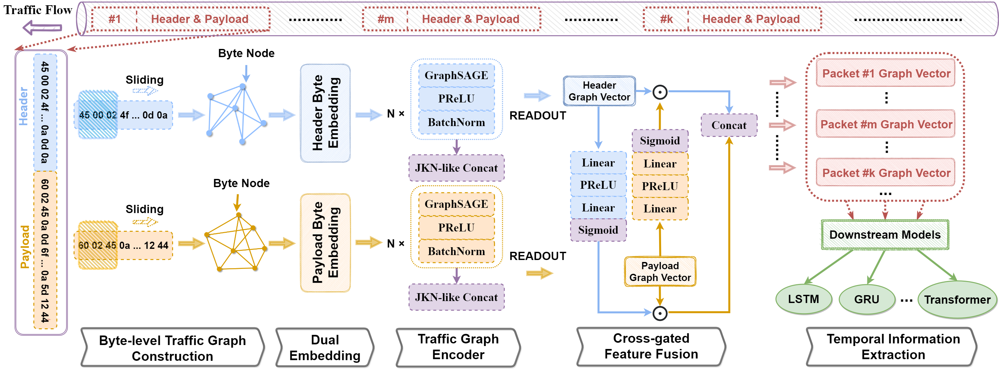

# TFE-GNN: A Temporal Fusion Encoder Using Graph Neural Networks for Fine-grained Encrypted Traffic Classification


Official implementation of the WWW'23 research paper: TFE-GNN: A Temporal Fusion Encoder Using Graph Neural Networks for Fine-grained Encrypted Traffic Classification. [[ACM](https://dl.acm.org/doi/abs/10.1145/3543507.3583227)]





## News

🔥 **[2024-12]** Our latest work [MH-Net](https://github.com/ViktorAxelsen/MH-Net) was accepted by AAAI 2025. We hope our work can bring some novel insights to the community, empowering network traffic identification with graph representation learning.

🌟 **[2024-01]** [CLE-TFE](https://github.com/ViktorAxelsen/CLE-TFE) is now open source, which is an improved version of TFE-GNN. 


## Environment Setup

```bash
# python==3.8
pip install torch==1.10.1+cu113 torchvision==0.11.2+cu113 torchaudio==0.10.1 -f https://download.pytorch.org/whl/cu113/torch_stable.html
pip install dgl==1.0.0+cu113 -f https://data.dgl.ai/wheels/cu113/repo.html
pip install scikit-learn
pip install scapy
```


## Pre-processing

### Download Datasets

[ISCXVPN2016](https://www.unb.ca/cic/datasets/vpn.html) & [ISCXTOR2016](https://www.unb.ca/cic/datasets/tor.html)


Or you can also prepare your own datasets.


### Obtain Bidirectional Flows


We use [SplitCap](https://www.netresec.com/?page=SplitCap) to obtain bidirectional flows for ISCX-VPN, ISCX-NonVPN, ISCX-TOR, and ISCX-NonTOR datasets, respectively. Please refer to it.

You may encounter some pcap file format conversion problems, and we just provide a simple script **pcapng2pcap.py** to convert .pcapng to .pcap files.


**Note**: We only use TCP pcap files in our work.


### Categorization Details

For specific categorization of each dataset, please refer to folder **CATE**.


### Convert .pcap to .npz Files

To facilitate subsequent processing, we extract the information of the .pcap file into the .npz file. 

You may refer to **config.py** and customize your own .pcap path in **DIR_PATH_DICT**. Then, run the following commands to start converting. 

```bash
# ISCX-VPN
python pcap2npy.py --dataset iscx-vpn
# ISCX-NonVPN
python pcap2npy.py --dataset iscx-nonvpn
# ISCX-TOR
python pcap2npy.py --dataset iscx-tor
# ISCX-NonTOR
python pcap2npy.py --dataset iscx-nontor
```


### Construct Byte-level Traffic Graphs

Before start constructing, you may refer to **config.py** and customize all your own file paths. Then, run the following commands to start constructing.

```bash
# ISCX-VPN
python preprocess.py --dataset iscx-vpn
# ISCX-NonVPN
python preprocess.py --dataset iscx-nonvpn
# ISCX-TOR
python preprocess.py --dataset iscx-tor
# ISCX-NonTOR
python preprocess.py --dataset iscx-nontor
```

This script will save the byte-level traffic graph of the specified dataset in the path you specify.


## Training

After pre-processing, run the following commands to start training.

```bash
# ISCX-VPN
python train.py --dataset iscx-vpn --cuda 0
# ISCX-NonVPN
python train.py --dataset iscx-nonvpn --cuda 0
# ISCX-TOR
python train.py --dataset iscx-tor --cuda 0
# ISCX-NonTOR
python train.py --dataset iscx-nontor --cuda 0
```


## Evaluation

After training, run the following commands to start evaluation.

```bash
# ISCX-VPN
python test.py --dataset iscx-vpn --cuda 0
# ISCX-NonVPN
python test.py --dataset iscx-nonvpn --cuda 0
# ISCX-TOR
python test.py --dataset iscx-tor --cuda 0
# ISCX-NonTOR
python test.py --dataset iscx-nontor --cuda 0
```


## Potential Bugs

- **remove() function in utils.py**

  + The location of the header in the packet may change, so check this when using other datasets.


## Note

There are some reasons for possible differences in reproduction results.

- System Environments. (including GPU driver version, etc.) (Verified)

- Data Partition.

  + Since most of the current network traffic datasets do not have a unified way to partition the training dataset and test dataset, this may lead to differences in results, which is normal.

In addition to potential differences, we recommend adjusting the hyperparameters in your data and environment configuration to achieve optimal results. 


## Citation

```bibtex
@Inproceedings{TFE-GNN,
  author={Haozhen Zhang and Le Yu and Xi Xiao* and Qing Li* and Francesco Mercaldo and Xiapu Luo and Qixu Liu},
  year="2023",
  title="TFE-GNN: A Temporal Fusion Encoder Using Graph Neural Networks for Fine-grained Encrypted Traffic Classification",
  booktitle="The Web Conference",
  pages="2066–2075",
}
```